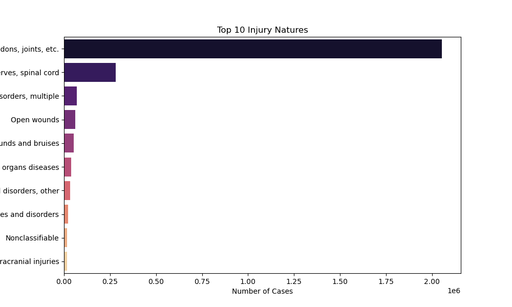
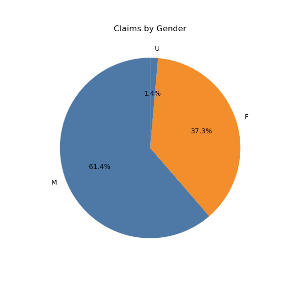
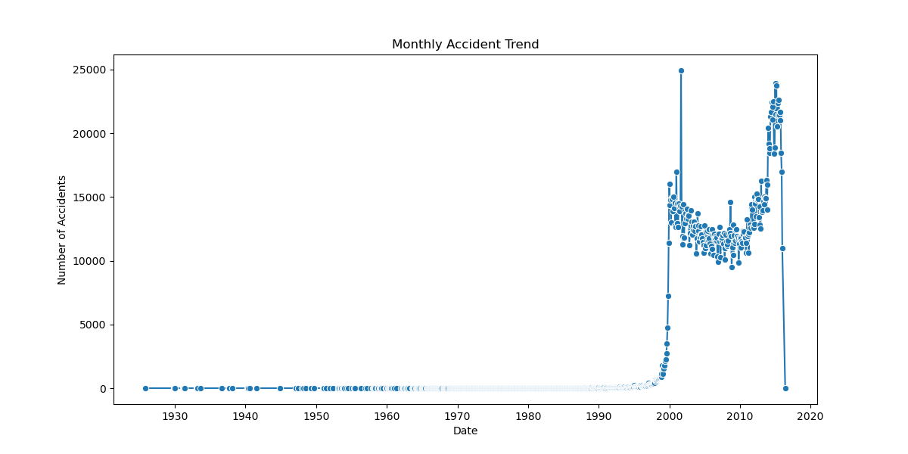
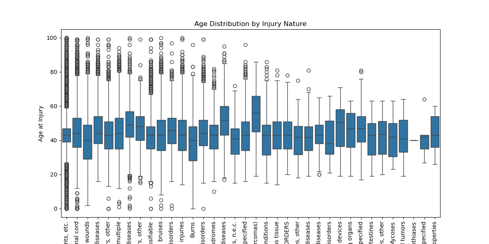
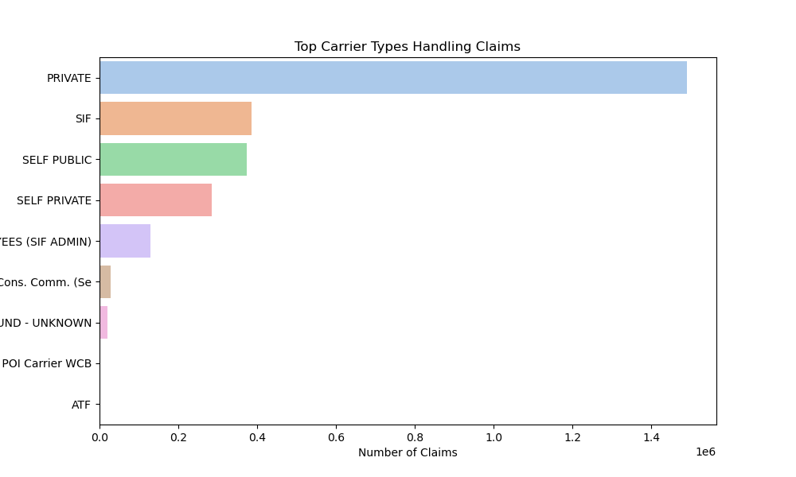
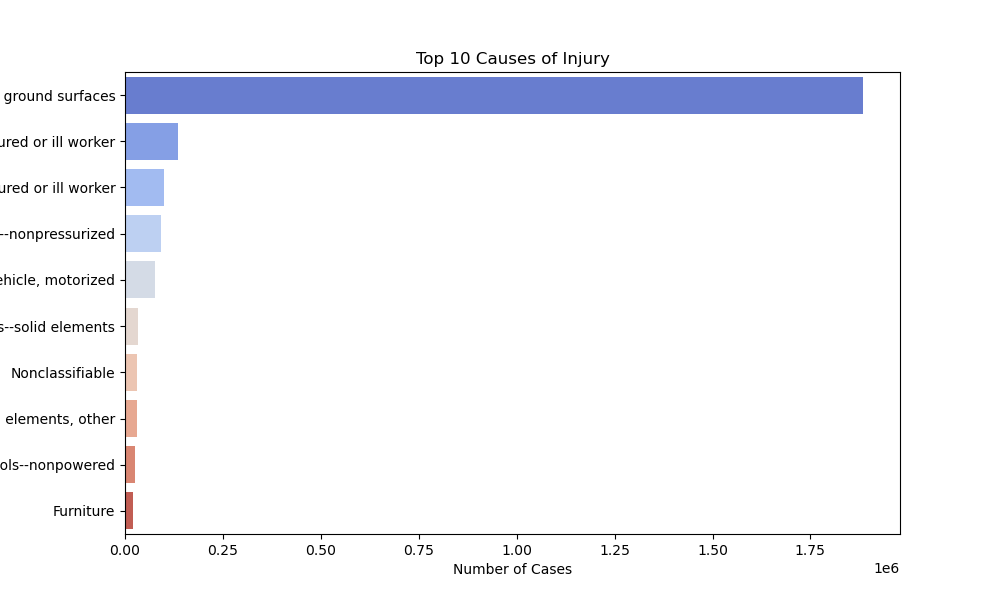
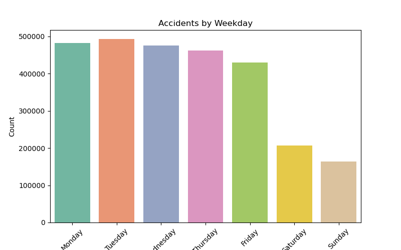
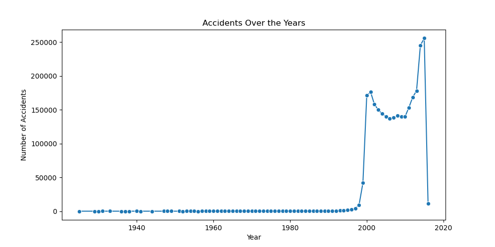
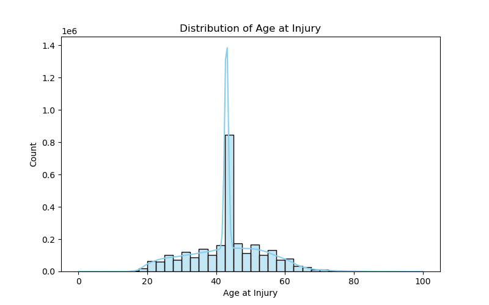

# 🩺 Workplace Injuries & Claims Analysis

## 📖 Project Overview
This project provides an **exploratory data analysis (EDA)** of workplace injuries and insurance claims.  
It combines **Python (pandas, matplotlib, seaborn)** to clean, explore, and visualize the dataset, and produces insights about:
- Most common types of injuries
- Accident trends over time
- Demographic risk factors (age, gender)
- Workplace risk sources (causes, carriers)

The analysis aims to **support occupational safety improvements** and **inform decision-making in claims management**.

---

## 📂 Repository Structure
```
workplace-injuries-analysis/
├── notebooks/
│ └── claims_data_preprocessing.ipynb # Jupyter Notebook with code 
│ └── analysis_visuals.ipynb # Jupyter Notebook with visualizations
├── results/
│ ├── age_distribution.png
│ ├── accidents_per_year.png
│ ├── accidents_by_weekday.png
│ ├── top_body_parts.png
│ ├── top_injury_nature.png
│ ├── top_injury_causes.png
│ ├── gender_distribution.png
│ ├── carrier_types.png
│ ├── age_vs_injury_nature.png
│ └── monthly_trend.png
└── README.md
```

---

## 🎯 Analysis Purpose
The main objectives of this analysis are:
- To **identify the most frequent injury types and causes**.  
- To **understand temporal patterns** (yearly, monthly, weekly accident trends).  
- To **analyze demographic patterns** (age, gender differences).  
- To **examine insurance carrier involvement** in handling claims.  
- To **generate actionable insights** for workplace safety policies.  

---

## 📊 Key Visualizations & Insights

### 1️⃣ Top 10 Injury Natures
  
- **Fractures, dislocations, etc.** dominate with nearly **2 million cases**.  
- Less frequent injuries (e.g., "Crucial minor injuries") have fewer than **1,000 cases**.  
➡️ Indicates that severe physical injuries are the most reported.

---

### 2️⃣ Claims by Gender
  
- **M (Male): 61.4%**  
- **F (Female): 37.3%**  
- **U (Unknown): 1.4%**  
➡️ Majority of claims are filed by male workers.

---

### 3️⃣ Monthly Accident Trend
  
- Low accident counts before 2000.  
- Sharp rise after 2000 reaching **~25,000 monthly cases**.  
- Steep decline after 2019, possibly due to incomplete data or reporting changes.  

---

### 4️⃣ Age Distribution by Injury Nature
  
- Most injuries occur at **younger ages**.  
- Certain rare injuries appear more often among older workers.  
➡️ Suggests targeted safety measures for different age groups.

---

### 5️⃣ Top Carrier Types Handling Claims
  
- **PRIVATE carriers** handle the majority (**>1.4 million claims**).  
- Other types (e.g., SELF PUBLIC, SELF PRIVATE) manage far fewer claims.  
➡️ Private carriers dominate workplace injury claim handling.

---

### 6️⃣ Top 10 Causes of Injury
  
- **Ground surfaces (unstable floors, scaffolding, etc.)** = ~**1.8 million cases**.  
- Other causes (furniture, materials, broken structures) contribute far less.  
➡️ Unsafe ground surfaces are the leading hazard.

---

### 7️⃣ Accidents by Weekday
  
- **Monday & Tuesday** show the highest accidents (~480k each).  
- Accidents steadily decline toward the weekend.  
➡️ Early workweek is the riskiest period.

---

### 8️⃣ Accidents Over the Years
  
- Low accident counts before 1990.  
- Sharp rise in the 1990s and 2000s, peaking near **250k–260k cases/year**.  
- Sharp decline around 2020 (likely due to missing/incomplete data).  

---

### 9️⃣ Distribution of Age at Injury
  
- Peak at **very young ages (0–15 years)**.  
- Lower frequencies across adult and older ages.  
➡️ Suggests many claims are linked to younger individuals, possibly dependents or minors.

---

## ✅ Conclusions & Recommendations
- **Ground surfaces** and **fractures/dislocations** are the most critical safety issues.  
- **Young workers** and **early weekdays** pose higher risk periods.  
- **Private carriers** dominate claims, suggesting concentrated responsibility.  
- **Workplace safety improvements** should focus on:  
  - Floor/ground stability  
  - Targeted training for younger workers  
  - Safety enforcement at the beginning of the week  

---

👤 **Prepared by:**  
Mohamed Emad Elhadi – *Data Analyst*  
